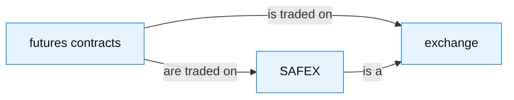

# Text-supported relation metric против strict HalluGraph

## Научный отчёт по фиксированной 100-QA оценке

> Главный вывод: **text-supported relation metric корректно восстанавливает
> текстовую поддержку отношений, пропущенных строгим graph alignment, но в
> данном независимом test set не улучшила response-level детекцию
> галлюцинаций.** Point estimate у strict выше: ROC-AUC `0.656` против
> `0.522`, F1 `0.714` против `0.560`. Доверительные интервалы широки и
> перекрываются, поэтому это не доказательство окончательного превосходства
> strict; однако 100-QA эксперимент не подтверждает исходную гипотезу о
> предиктивном преимуществе support.

---

## 1. Вопрос исследования

### 1.1. Baseline: strict HalluGraph

Для каждого RAG-ответа строятся три knowledge graph:

- `G_C` — граф retrieved context;
- `G_Q` — граф вопроса;
- `G_A` — граф ответа;
- `G_ref = G_C ∪ G_Q` — reference graph.

Историческая строгая метрика (**strict**) проверяет для каждого ребра ответа,
существует ли направленно совместимое ребро в `G_ref`. Поэтому она измеряет
следующее: *удалось ли KG pipeline извлечь семантически согласованное
отношение и из ответа, и из reference?*

Это полезный, но узкий критерий: отсутствие graph alignment может означать
не отсутствие факта в тексте, а другую декомпозицию сущностей или отношений
при KG extraction.

### 1.2. Гипотеза support

Новая метрика (**support**) должна быть устойчивее к неполному reference KG.
Для заземлённого answer edge она извлекает релевантные предложения из context
и вопроса и просит verifier отнести утверждение к `entailed`, `contradicted`
или `unknown`.

Ключевой принцип: одного совпадения сущностей недостаточно. Отношение
получает credit только при текстовом `entailed`-verdict.

### 1.3. Формулы

Пусть `V_A` и `E_A` — сущности и рёбра графа ответа.

```text
EG = |{v ∈ V_A : match(v, V_ref)}| / |V_A|

RP_strict = |{e ∈ E_A : ∃e_ref ∈ E_ref, align(e, e_ref)}| / |E_A|

RP_grounded = |{e=(s,r,o) ∈ E_A : match(s,V_ref) ∧ match(o,V_ref)}| / |E_A|

RP_entailed_cond = |{grounded e : verifier(e)=entailed}| / |{grounded e}|

RP_support = |{grounded e : verifier(e)=entailed}| / |E_A|
           = RP_grounded × RP_entailed_cond

CFI_mode = α_mode × EG + (1 − α_mode) × RP_mode
H_mode   = 1 − CFI_mode
```

Чем больше `H`, тем более вероятной считается галлюцинация. Если в `G_A` нет
рёбер, relation component не заменяется нулём: такой ответ отмечается
`unscorable` и не включается в основную метрику.

### 1.4. Статусы edge audit

| Статус | Интерпретация |
|---|---|
| `aligned` | Ребро прошло strict graph alignment и verifier подтвердил его. |
| `entailed_from_text` | Strict alignment не найден, но текст напрямую поддерживает факт. |
| `grounded_unknown` | Оба endpoint заземлены, но evidence недостаточно для подтверждения. |
| `contradicted` | Endpoint заземлены, а verifier считает утверждение противоречащим evidence. |
| `ungrounded_subject` / `ungrounded_object` / `ungrounded_both` | Хотя бы один endpoint не найден в `G_ref`; verifier не вызывается. |

`unknown` и `contradicted` не увеличивают `RP_support`.

---

## 2. Дизайн оценки

Использован один заранее зафиксированный, детерминированный manifest из
**100 RAGTruth QA** записей: одна response на source, одинаковый для strict и
support.

| Часть | Записей | `y=0` | `y=1` | Назначение |
|---|---:|---:|---:|---|
| Train | 80 | 40 | 40 | Выбор `α`, `τ_e`, `τ_r` и порога `θ`. |
| Held-out test | 20 | 10 | 10 | Однократная финальная оценка. |
| Всего | 100 | 50 | 50 | Парное сравнение strict и support. |

`y=1` означает, что человек-разметчик RAGTruth отметил в ответе хотя бы один
галлюцинаторный span. Это **response-level**, а не edge-level метка: один
неверный фрагмент оставляет ответу `y=1`, даже если большинство его отношений
фактически верно.

Чтобы сравнение было честным:

- `G_C`, `G_Q` и `G_A` извлечались один раз и переиспользовались обоими
  детекторами;
- strict и support получили один manifest, split и KG cache;
- `α`, entity/relation thresholds и порог классификации выбирались только на
  80 train записях;
- подбор использовал stratified 5-fold cross-validation на train;
- test не участвовал ни в одном этапе tuning;
- базовая модель извлечения и verifier фиксированы, temperature равна нулю.

---

## 3. Качество данных и валидность сравнения

| Проверка | Результат |
|---|---|
| Завершённые `(G_C, G_Q, G_A)` пары | 100 / 100 |
| Failed extractions | 0 |
| Пустые reference graphs | 0 |
| Пустые answer graphs | 2 / 100 |
| Unscorable ответы | 2: один train и один test, оба с `y=0` |
| Основная test оценка | 19 scorable ответов: 10 `y=1`, 9 `y=0` |
| KG cache до/после support | Идентичен |
| Strict cache-only replay | 0 новых LLM-вызовов, `metrics.csv` идентичен live версии |
| Support cache-only replay | 0 новых LLM-вызовов, `metrics.csv` идентичен live версии |

Следовательно, разница strict/support не объясняется новой генерацией графов,
сменой данных или дрейфом extraction. Меняется relation-semantic scoring.

---

## 4. Основной результат: held-out detection

### 4.1. Подобранные на train параметры и test качество

| Детектор | `α` | `τ_e` / `τ_r` | `θ` | Mean 5-fold train CV AUC | Train F1 | Test ROC-AUC (95% CI) | Test P / R / F1 (F1 95% CI) |
|---|---:|---:|---:|---:|---:|---:|---:|
| Strict HalluGraph | 0.70 | 0.90 / 0.75 | 0.2405 | 0.7214 | 0.7207 | **0.6556** [0.3586; 0.8778] | **0.5556 / 1.0000 / 0.7143** [0.4800; 0.8750] |
| Text-supported relation | 0.30 | 0.85 / 0.75 | 0.2270 | **0.7246** | **0.7647** | 0.5222 [0.2179; 0.8000] | 0.4667 / 0.7000 / 0.5600 [0.2727; 0.7694] |

На train CV разница практически отсутствует: support выше strict всего на
`0.0031` AUC. На ранее неиспользованном test strict выше на `0.1333` AUC и
`0.1543` F1. Это несовпадение — важное свидетельство нестабильности tuning на
80 наблюдениях и отсутствия убедимого переноса преимущества support.

95% bootstrap intervals обеих AUC широки и перекрываются. Поэтому корректный
вывод не «strict доказанно лучше», а: **в данном held-out наборе строгий
baseline имеет лучшие point estimates, а support не подтвердил улучшение.**

### 4.2. Матрицы ошибок

Правило: `ŷ=1`, если `H ≥ θ`. Один пустой graph ответа (`y=0`) исключён из
обеих основных оценок.

| Детектор | TP | FP | TN | FN | Интерпретация |
|---|---:|---:|---:|---:|---|
| Strict | 10 | 8 | 1 | 0 | Находит все 10 positive responses, но даёт много ложных тревог. |
| Support | 7 | 8 | 1 | 3 | Не уменьшает FP, но пропускает три hallucinated responses. |

Именно эти три дополнительных false negative объясняют падение recall support
с `1.00` до `0.70` и F1 с `0.714` до `0.560`.

### 4.3. Все held-out ответы

| Response | `y` | Strict `H` | Strict `ŷ` | Support `H` | Support `ŷ` |
|---:|---:|---:|---:|---:|---:|
| 13313 | 0 | 0.3461 | 1 | 0.3794 | 1 |
| 13913 | 0 | 0.5800 | 1 | 0.5719 | 1 |
| 14289 | 0 | 0.5333 | 1 | 0.6194 | 1 |
| 14742 | 0 | 0.2700 | 1 | 0.0350 | 0 |
| 15626 | 0 | 0.4082 | 1 | 0.4870 | 1 |
| 15968 | 0 | unscorable | — | unscorable | — |
| 16560 | 0 | 0.2900 | 1 | 0.2450 | 1 |
| 16690 | 0 | 0.4375 | 1 | 0.4000 | 1 |
| 17233 | 0 | 0.1822 | 0 | 0.2880 | 1 |
| 17571 | 0 | 0.4814 | 1 | 0.5653 | 1 |
| 12842 | 1 | 0.3432 | 1 | 0.2205 | 0 |
| 13105 | 1 | 0.5813 | 1 | 0.6078 | 1 |
| 13363 | 1 | 0.2737 | 1 | 0.1871 | 0 |
| 14097 | 1 | 0.4102 | 1 | 0.2615 | 1 |
| 14846 | 1 | 0.3962 | 1 | 0.3766 | 1 |
| 15345 | 1 | 0.6038 | 1 | 0.6167 | 1 |
| 15556 | 1 | 0.7526 | 1 | 0.7656 | 1 |
| 15713 | 1 | 0.2667 | 1 | 0.2250 | 0 |
| 16056 | 1 | 0.5545 | 1 | 0.4591 | 1 |
| 16510 | 1 | 0.6818 | 1 | 0.6483 | 1 |

Средний strict `H` у positive test ответов равен `0.4864`, у factual —
`0.3921`. У support эти значения ближе: `0.4368` и `0.3990` соответственно.
Support таким образом уменьшает разделение классов именно в этом held-out
срезе.

### 4.4. Ablation: что несёт сигнал

| Score на test | Strict AUC | Support AUC |
|---|---:|---:|
| Entity grounding only (`EG`) | 0.7056 | 0.7222 |
| Relation component only (`RP`) | 0.5000 | 0.4944 |
| Итоговый `H = 1 − CFI` | 0.6556 | 0.5222 |

В этом наборе основной ранжирующий сигнал приходит от **entity grounding**, а
relation component сам по себе близок к случайному. У support выбранный
`α=0.30` придаёт relation score вес `0.70`; это снижает вклад более сильного
entity-сигнала и согласуется с худшей held-out AUC.

---

## 5. Что support меняет механически

### 5.1. Чистый semantic effect при одинаковых настройках

Чтобы отделить новую relation semantics от независимого tuning, обе relation
метрики пересчитаны на графах support-конфигурации с одинаковыми
`α=0.30`, `τ_e=0.85`, `τ_r=0.75`.

| Показатель на 98 scorable ответах | Значение |
|---|---:|
| Support снизил `H` | 92 / 98 (93.9%) |
| `H` не изменился | 5 / 98 |
| Support повысил `H` | 1 / 98 |
| Среднее `H_support − H_strict` | **−0.2243** |
| Медиана разницы | **−0.2138** |
| Наибольшее снижение | −0.6000 |

Это сильное **механическое подтверждение** гипотезы: текстовый verifier
находит множество отношений, не прошедших строгую графовую проверку, и в
результате систематически уменьшает hallucination score.

### 5.2. Почему это не равно улучшению детектора

Полные pipelines используют independently selected параметры: strict
`α=0.70, τ_e=0.90`, support `α=0.30, τ_e=0.85`. При таком полноценном
сравнении на тех же 98 scorable ответах:

| Показатель | Значение |
|---|---:|
| Среднее `H_support(tuned) − H_strict(tuned)` | −0.0063 |
| Медиана | +0.0004 |
| Support снизил `H` | 49 / 98 |
| Support повысил `H` | 49 / 98 |

Иными словами, после tuning систематический сдвиг score почти исчезает. Это
два разных анализа: первый отвечает на вопрос «что делает новая semantic
проверка?», второй — «как работают две целиком настроенные модели?». Их нельзя
сводить к одному числу «улучшения».

### 5.3. Edge-level audit

Во всех 100 answer graphs извлечено **1 855** рёбер. Категории ниже полностью
суммируются до этого числа.

| Проверка / статус | Число рёбер | Доля |
|---|---:|---:|
| Strict `aligned` | 258 | 13.9% |
| Strict `grounded_unverified` | 758 | 40.9% |
| Strict ungrounded: subject / object / оба | 347 / 301 / 191 | 45.2% суммарно |
| Support `aligned` | 242 | 13.0% |
| Support `entailed_from_text` | 612 | 33.0% |
| **Support-confirmed** (`aligned + entailed_from_text`) | **854** | **46.0%** |
| Support `grounded_unknown` | 155 | 8.4% |
| Support `contradicted` | 33 | 1.8% |
| Support ungrounded: subject / object / оба | 332 / 296 / 185 | 43.8% суммарно |

В support-mode verifier получил 1 042 grounded relations. Он подтвердил 854
из них (`82.0%`), оставил `unknown` 155 (`14.9%`) и вернул `contradicted` 33
(`3.2%`). Из 258 strict-aligned рёбер 242 были также подтверждены, а 26
получили `unknown` и 4 — `contradicted`. Одновременно появились 612 новых
`entailed_from_text` отношений, которые strict alignment не находил.

Это показывает, что support не просто делает критерий мягче: он добавляет
проверяемое evidence и иногда отказывает даже строгому совпадению графов.
Но почти 44% рёбер не доходят до verifier из-за незаземлённых endpoints — это
главный предел текущей архитектуры.

---

## 6. Реальные edge audits

### 6.1. Support исправляет ложную тревогу: response `14742`

Это factual test ответ (`y=0`). Strict пометил его как hallucinated:
`H=0.2700 ≥ 0.2405`. Support получил `H=0.0350 < 0.2270` и верно снял
тревогу.

| Показатель | Strict | Support |
|---|---:|---:|
| `EG` | 1.0000 | 1.0000 |
| Relation score | `RP_strict=0.1000` | `RP_support=0.9500` |
| Решение | false positive | true negative |

Из 20 answer edges verifier подтвердил 19, включая «DMSO — can penetrate →
skin», «DMSO — is used as → anti-inflammatory» и «DMSO — promotes →
healing». Это хороший пример того, для чего support задуман: строгий KG
alignment пропустил множество фактов, прямо присутствующих в context.

### 6.2. Support видит evidence, но маскирует частичную галлюцинацию: response `13363`

Этот test ответ имеет human label `y=1` (`Subtle Baseless Info`). Strict
предсказал positive, а support — negative.

| Показатель | Strict | Support |
|---|---:|---:|
| `EG` | 0.8947 | 0.8947 |
| Relation score | `RP_strict=0.3333` | `RP_support=0.7778` |
| `H` | 0.2737 | 0.1871 |
| Решение | 1 (верно) | 0 (false negative) |

| Answer edge | Strict status | Evidence / verdict | Финальный status |
|---|---|---|---|
| `baking soda — stand in → wine glass` | Нет graph alignment | «Dissolve … soda with hot water and let it stand in the glass…» → `entailed` | `entailed_from_text` |
| `inside of the glass — scrub with → stemware brush` | Нет graph alignment | «…use a stemware brush with soft-foam bristles.» → `entailed` | `entailed_from_text` |
| `lint-free cloth — is a type of → microfiber` | Strict alignment найден | Evidence перечисляет microfiber как пример cloth, но не как его тип → `contradicted` | `contradicted` |
| `wine glass — avoid → spots` | Заземлено | «…tips to avoid chips and spots» → `unknown` | `grounded_unknown` |

Пример одновременно демонстрирует достоинство и ограничение support. Он
прозрачно подтверждает большинство корректных инструкций и отклоняет одно
неаккуратное strict совпадение. Но response-level label `y=1` может зависеть
от одного тонкого baseless fragment; восстановление большого числа верных
отношений уменьшает общий `H` и скрывает эту частичную галлюцинацию.

### 6.3. Иллюстрация из Obsidian: откуда берётся пропуск strict

Этот компактный пример из существующего vault
[`results/micro_qa_large_15221`](../results/micro_qa_large_15221/overview.md)
служит только иллюстрацией механизма, а не строкой текущей оценки.



Reference graph содержит «futures contracts — is traded on → exchange» и
«SAFEX — is a → exchange», а answer graph формулирует конкретнее «futures
contracts — are traded on → SAFEX». Exact directed alignment может не найти
такое ребро. Support не должен автоматически делать транзитивный вывод, но
может проверить исходное предложение: «…traded on an exchange, like SAFEX».

---

## 7. Ограничения и корректная интерпретация

1. **Эффективный test всё ещё мал.** После исключения одного пустого графа
   остаётся 19 ответов; AUC confidence intervals широки. Point estimates
   информативны, но не являются окончательным доказательством.
2. **Метка ответа не равна метке каждого отношения.** Positive response может
   содержать много entailed edges; это систематически затрудняет edge-based
   детекцию тонкой частичной галлюцинации.
3. **Verifier является ещё одной вероятностной моделью.** Его понимание
   evidence и преобразование текста в triple добавляют собственную ошибку.
4. **Entity grounding — bottleneck.** 813 из 1 855 рёбер support не передал
   verifier из-за незаземлённого subject, object или обоих endpoints.
5. **Независимый tuning меняет сам detector.** Разные `α` и `τ_e` не позволяют
   трактовать разность fully tuned score как чистый каузальный эффект verifier.
6. **Выбран один фиксированный manifest.** Повторная оценка на независимой
   larger sample нужна до широкого обобщения результата.
7. **Внешние baseline-числа намеренно не используются.** Сравнение с работами,
   использующими другой split, модель или разметку, было бы методологически
   несопоставимым.

---

## 8. Вывод по гипотезе

Гипотеза получила **сильное механическое**, но не **предиктивное**
подтверждение.

- Support надёжно находит текстовую поддержку для 612 отношений, которые
  strict graph alignment не сопоставил, и делает audit существенно более
  интерпретируемым.
- При фиксированных параметрах это резко и ожидаемо уменьшает `H`.
- Но в задаче response-level hallucination detection это уменьшение не
  избирательно: оно понижает score и у factual ответов, и у positive responses
  с одним ложным фрагментом.
- На held-out 100-QA experiment strict имеет лучшие AUC, recall и F1; support
  не уменьшил число false positive и добавил три false negative.

Научно корректная формулировка для представления:

> Text-supported relation metric — это содержательно обоснованное и
> аудируемое расширение strict graph alignment. Она повышает coverage
> текстово подтверждённых отношений, но в текущей 100-QA held-out оценке не
> улучшает детекцию галлюцинаций относительно strict HalluGraph. В текущем
> виде support разумнее рассматривать как диагностический канал evidence, а
> не как замену baseline relation score.

### Следующий подтверждающий эксперимент

1. Зафиксировать новый, более крупный source-level manifest до запуска.
2. Сохранить парный дизайн: единые `G_C/G_Q/G_A` cache и split для обеих
   метрик.
3. Оставить все hyperparameters строго train-only и провести финальную оценку
   на ранее не тронутом test.
4. Добавить отдельную edge-level выборку с human verdict, чтобы проверить
   соответствие `entailed`/`contradicted` реальности, а не только response
   label.
5. Разделить ошибки на partial/subtle/evident hallucination и отдельно
   анализировать случаи с незаземлёнными endpoint.
6. Проверить не только замену `RP_strict → RP_support`, но и двухканальную
   модель: сохранить strict score как сигнал подозрения, а evidence/verdict
   использовать для объяснения и последующей калибровки.

---

## Источники первичных результатов

Все числа в этом документе сверены с полным архивом фиксированной 100-QA
оценки: manifest, результаты strict/support, tuning outputs, per-response
audits и cache-only replays. Детали инфраструктурного запуска намеренно
исключены из отчёта.

Методологический контекст описан в
[документе гипотезы](new-metrics-hypothesis.md). Внешние опубликованные
числа не использовались как baseline.
