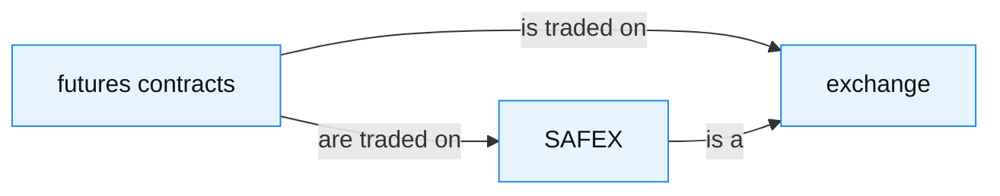

# Text-supported relation metric против strict HalluGraph

## Научный отчёт по фиксированному 20-QA пилоту

| Поле | Значение |
|---|---|
| Статус | Завершён успешно 19 июля 2026 года |
| DataSphere Job | `bt1g7fbvpvbk3l1lbs5c` (`SUCCESS`) |
| Режим | `cpu-vertex-20qa-strict-support` |
| Исходный коммит | `a7213a196ec3839c4dc2d4476b804bf343fc22ae` |
| LLM для извлечения и verifier | `gemini-2.5-flash` через Vertex AI (`europe-west4`) |
| Модель эмбеддингов | `sentence-transformers/all-MiniLM-L6-v2` на CPU |
| Архив результата | `vertex-cpu-qa-pilot-vertex-20qa-20260719-r2.tar.gz` |
**SHA-256 архива:** `153a27c3e1c5ef30e0d189a9ee01510105fd0ad6d20830ce3c57c579782b69a6`

> Главный вывод: новый support-вариант прозрачно восстанавливает текстовую
> поддержку отношений, которые strict KG alignment не увидел, но на данном
> 20-QA пилоте **не показал улучшения качества детекции галлюцинаций**.
> На независимых четырёх test примерах оба метода дали ROC-AUC `0.50` и F1
> `0.00`. Это пилотная диагностика механизма, а не доказательство превосходства
> новой метрики.

---

## 1. Вопрос исследования и проверяемая гипотеза

### 1.1. Что является baseline

Baseline — историческая строгая метрика HalluGraph, далее **strict**. Для
каждого ответа строятся три графа:

- `G_C` — граф retrieved context;
- `G_Q` — граф вопроса;
- `G_A` — граф ответа;
- `G_ref = G_C ∪ G_Q` — reference graph.

Strict проверяет, есть ли для каждого answer edge направленное совместимое
ребро в `G_ref`. Это корректно отвечает на вопрос: *«извлёк ли KG pipeline
сходное отношение?»* Однако ответ «нет» может быть следствием неполного или
иначе сформулированного KG, а не отсутствия факта в исходном тексте.

### 1.2. Гипотеза

Новая метрика **support** должна быть устойчивее к неполному извлечению
reference KG. Она отделяет две вещи:

1. оба конца отношения должны быть заземлены в `G_ref`;
2. сам факт должен быть подтверждён предложениями из исходных context/query.

Иными словами, support не считает отношение корректным только потому, что в
графе встречаются его сущности: verifier обязан вернуть `entailed` по
отобранному текстовому evidence.

### 1.3. Формулы

Пусть `V_A` и `E_A` — сущности и рёбра ответа.

```text
EG = |{v ∈ V_A : match(v, V_ref)}| / |V_A|

RP_strict = |{e ∈ E_A : ∃e_ref ∈ E_ref, align(e, e_ref)}| / |E_A|

RP_grounded = |{e=(s,r,o) ∈ E_A : match(s,V_ref) ∧ match(o,V_ref)}| / |E_A|

RP_entailed_cond = |{grounded e : verifier(e)=entailed}| / |{grounded e}|

RP_support = |{grounded e : verifier(e)=entailed}| / |E_A|
           = RP_grounded × RP_entailed_cond

CFI_mode = α_mode × EG + (1 − α_mode) × RP_mode
H_mode   = 1 − CFI_mode
```

Больший `H` означает более сильное подозрение на галлюцинацию. Если в ответе
нет рёбер, relation component не подменяется нулём: такой ответ отмечается
`unscorable` и обрабатывается отдельной политикой отчёта.

### 1.4. Семантика статусов рёбер

| Статус | Значение |
|---|---|
| `aligned` | В strict audit: есть strict graph alignment. В support audit: это alignment, который verifier также подтвердил. |
| `entailed_from_text` | Strict alignment нет, но текстовое evidence подтверждает факт. |
| `grounded_unknown` | Оба конца заземлены, но verifier не получил достаточного подтверждения. |
| `contradicted` | Оба конца заземлены, verifier признал факт противоречащим evidence. |
| `ungrounded_subject` / `ungrounded_object` / `ungrounded_both` | До verifier дело не доходит: хотя бы один конец отсутствует в `G_ref`. |

`unknown` и `contradicted` не увеличивают `RP_support`.

---

## 2. Дизайн эксперимента

### 2.1. Данные и split

Использован один детерминированный manifest из **20 RAGTruth QA** записей.

| Часть | Число записей | Human label `y=0` | Human label `y=1` | Назначение |
|---|---:|---:|---:|---|
| Train | 16 | 8 | 8 | Подбор `α`, `τ_e`, `τ_r` и порога `θ`. |
| Test | 4 | 2 | 2 | Единственная финальная оценка. |
| Всего | 20 | 10 | 10 | Один и тот же manifest для strict и support. |

`y=1` означает, что в RAGTruth ответ имеет хотя бы один размеченный
галлюцинаторный span. Это важно для последующего анализа: ответ может быть в
основном верным, но всё равно иметь метку `1` из-за одного тонкого baseless
фрагмента.

### 2.2. Контроль честности сравнения

- `G_C`, `G_Q`, `G_A` извлечены один раз в strict phase и затем переиспользованы
  в support phase из одного content-addressed KG cache.
- Для strict и support использован один и тот же 20-QA manifest и один split.
- `α`, entity threshold `τ_e`, relation threshold `τ_r` и decision threshold
  `θ` выбирались только по train. Test не участвовал в подборе.
- Tuning выполнялся stratified 5-fold CV на 16 train примерах.
- При support verifier получает только top-k evidence sentences из `C ∪ Q` и
  возвращает строго один JSON verdict: `entailed`, `contradicted` либо
  `unknown`.
- `temperature=0.0`; KGGen clustering включён с `cluster_context_mode=source_text`.

### 2.3. Выполнимость и воспроизводимость

Полный Job прошёл все предусмотренные контракты:

| Проверка | Результат |
|---|---|
| KGGen structured extraction + clustering | Пройдена. |
| Verifier JSON-schema path | Пройдена. |
| Завершённые extraction пары | 20/20. |
| `failed_extractions.jsonl` | Пустой для strict и support. |
| KG cache до/после support | Одинаковый SHA-256 listing. |
| Strict cache-only replay | 0 live API calls, CSV идентичен live strict. |
| Support cache-only replay | 0 live API calls, CSV идентичен live support. |
| Cache tree до/после replay | Одинаковый SHA-256 listing. |

Таким образом, разница между strict и support в этом отчёте не вызвана новой
экстракцией графов или дрейфом выборки: меняется именно relation-semantic
scoring.

---

## 3. Основные результаты

### 3.1. Подобранные параметры и итоговая test оценка

| Детектор | `α` | `τ_e` | `τ_r` | `θ` | Mean 5-fold train CV AUC | Train F1 при `θ` | Test ROC-AUC | Test F1 | Test P / R |
|---|---:|---:|---:|---:|---:|---:|---:|---:|---:|
| Strict HalluGraph | 0.90 | 0.90 | 0.75 | 0.4700 | **0.80** | 0.7143 | 0.50 | 0.00 | 0.00 / 0.00 |
| Text-supported relation | 0.70 | 0.90 | 0.75 | 0.4838 | **0.70** | 0.7143 | 0.50 | 0.00 | 0.00 / 0.00 |

Для обоих test ROC-AUC bootstrap 95% CI равен `[0.00, 1.00]`. При `n_test=4`
интервал настолько широк, что нельзя делать вывод ни о преимуществе, ни о
недостатке одного из методов по итоговой детекции.

**Интерпретация train CV.** В этой конкретной малой выборке strict получил
mean CV AUC `0.80`, support — `0.70`. Это не является окончательным
сравнением методов: одновременно малы и train, и число CV-fold observations,
а support добавляет ещё один вероятностный LLM verifier. Но число обязательно
нужно сообщать: нынешний пилот не даёт эмпирического основания утверждать,
что новая метрика уже лучше baseline.

### 3.2. Все test записи и решения при подобранных порогах

Правило классификации: `ŷ = 1`, если `H ≥ θ`.

| Response ID | Source ID | Human `y` | Strict `H` | Strict `ŷ` | Support `H` | Support `ŷ` |
|---:|---:|---:|---:|---:|---:|---:|
| 13313 | 15138 | 0 | 0.2265 | 0 | 0.2578 | 0 |
| 13363 | 15147 | 1 | 0.1614 | 0 | 0.1404 | 0 |
| 14846 | 15395 | 1 | 0.3139 | 0 | 0.3172 | 0 |
| 15626 | 15525 | 0 | 0.2611 | 0 | 0.3159 | 0 |

Оба детектора классифицировали все четыре test ответа как `0` (без
галлюцинации). Поэтому для каждого из них: 2 true negatives, 2 false
negatives, 0 true positives, 0 false positives; следовательно, recall и F1
для положительного класса равны нулю.

Ранжирование всё же не полностью одинаково: в каждой версии один положительный
ответ получает больший `H`, чем оба отрицательных, а второй — меньший. Это
даёт ровно 2 выигрышные пары из 4 и ROC-AUC `0.50`.

### 3.3. Распределение `H` по метке

Средние посчитаны только по scorable ответам: один train ответ с пустым
`G_A` исключён из этой агрегации.

| Split | Метка | Strict mean `H` | Support mean `H` |
|---|---:|---:|---:|
| Train | `y=0` (`n=7` scorable) | 0.3309 | 0.3507 |
| Train | `y=1` (`n=8`) | 0.5141 | 0.5326 |
| Test | `y=0` (`n=2`) | 0.2438 | 0.2869 |
| Test | `y=1` (`n=2`) | 0.2376 | 0.2288 |

На train средний `H` положительного класса выше отрицательного для обеих
метрик. На test порядок меняется, что согласуется с AUC `0.50` и подчёркивает
сильную нестабильность оценки на четырёх примерах.

---

## 4. Что именно меняет support

### 4.1. Эффект при фиксированном `α=0.7`

Это наиболее чистая проверка именно новой relation semantics. В support
артефакте одновременно доступны `H_strict` и `H_support`, рассчитанные на
одних графах и с одинаковым `α=0.7`.

| Показатель | Значение |
|---|---:|
| Scorable ответов | 19 |
| Ответов, у которых support снизил `H` | 17 / 19 |
| Ответов без изменения `H` | 2 / 19 |
| Ответов с увеличением `H` | 0 / 19 |
| Среднее `H_support − H_strict` | **−0.0798** |
| Медиана разницы | −0.0789 |
| Средняя разница на test (`n=4`) | −0.0982 |
| Максимальное снижение `H` | −0.1500 (response 12972) |

Это ожидаемый механический эффект гипотезы: если strict не нашёл идентичное
ребро, но verifier нашёл достаточное текстовое evidence, `RP_support` растёт
и ответ получает меньший hallucination score.

### 4.2. Эффект полноценных independently tuned pipelines

Это **другая** величина. Здесь strict использует выбранное `α=0.9`, support —
выбранное `α=0.7`; поэтому меняются и relation semantics, и вес relation
component.

| Показатель на 19 scorable ответах | Значение |
|---|---:|
| Среднее `H_support(tuned) − H_strict(tuned)` | **+0.0186** |
| Медиана разницы | +0.0140 |
| Рост `H` | 17 ответов |
| Снижение `H` | 2 ответа |

Это **не** опровержение текстовой проверки отношений и **не** доказательство
ухудшения модели. Метрики используют разные independently selected `α`, а
следовательно отвечают с разным относительным весом entity и relation
components. По этой причине научно корректно показывать оба анализа и не
сводить их к одному числу «улучшения».

### 4.3. Полный edge-level breakdown

В 19 scorable answer graphs было **384** рёбра. Их разметка полностью
согласуется: все категории в каждой строке суммируются до 384.

| Проверка / статус | Число рёбер | Доля всех 384 |
|---|---:|---:|
| Strict `aligned` | 64 | 16.7% |
| Strict `grounded_unverified` | 133 | 34.6% |
| Незаземлённые концы: subject / object / оба | 68 / 77 / 42 | 48.7% суммарно |
| **Заземлённые рёбра, переданные verifier** | **197** | **51.3%** |
| Support `aligned` | 57 | 14.8% |
| Support `entailed_from_text` | 107 | 27.9% |
| **Support-confirmed (`aligned + entailed_from_text`)** | **164** | **42.7%** |
| Support `grounded_unknown` | 27 | 7.0% |
| Support `contradicted` | 6 | 1.6% |
| Незаземлённые рёбра | 187 | 48.7% |

Среди 197 grounded edges verifier признал 164 entailed (`83.2%`), 27 unknown
(`13.7%`) и 6 contradicted (`3.0%`). В сравнении с 64 строгими alignment
подтверждённые текстом отношения дают чистое расширение coverage: support
получает 107 `entailed_from_text`, но также не принимает на веру семь
strict-aligned отношений, не прошедших текстовую проверку.

---

## 5. Размер и сложность извлечённых графов

Значения ниже относятся к 19 scorable ответам; один пустой `G_A` исключён.

| Граф | Сумма вершин | Среднее вершин | Диапазон вершин | Сумма рёбер | Среднее рёбер | Диапазон рёбер |
|---|---:|---:|---:|---:|---:|---:|
| `G_C` | 495 | 26.05 | 16–46 | 509 | 26.79 | 17–48 |
| `G_Q` | 32 | 1.68 | 1–3 | 16 | 0.84 | 0–3 |
| `G_A` | 365 | 19.21 | 9–33 | 384 | 20.21 | 10–36 |

На test subset средний answer graph содержит 18.75 сущности и 16.75 рёбер.
Это важно для интерпретации стоимости: support не делает один verdict на
ответ, а проверяет каждое grounded answer edge.

---

## 6. Вычислительная эффективность и воспроизводимость

### 6.1. Фактическая нагрузка Vertex

| Фаза | Live API calls | Requests всего | Cache hits | Prompt tokens | Completion tokens |
|---|---:|---:|---:|---:|---:|
| Strict: извлечение 20 × (`G_C`, `G_Q`, `G_A`) | 60 | 60 | 0 | 743,198 | 90,641 |
| Strict scoring / tuning / evaluate через KG cache | 0 | 60 | 60 | 0 | 0 |
| Support relation verifier | 492 | 706 | 214 | 79,251 | 6,281 |
| Strict cache-only replay | 0 | 60 | 60 | 0 | 0 |
| Support cache-only replay | 0 | 706 | 706 | 0 | 0 |

Итоги основного live pipeline:

| Сравнение | Strict only | Strict + support | Изменение |
|---|---:|---:|---:|
| Live API calls | 60 | 552 | 9.2× больше |
| Всего billed tokens | 833,839 | 919,371 | +85,532 (+10.3%) |
| Prompt tokens | 743,198 | 822,449 | +10.7% |
| Completion tokens | 90,641 | 96,922 | +6.9% |

Полный DataSphere Job выполнился примерно за 113 минут. Это время включает
извлечение, verifier, tuning, evaluation, audit, cache-only replay и
упаковку артефактов, поэтому его нельзя приписывать только support phase.

**Стоимость в деньгах здесь намеренно не указывается.** Архив хранит токены
и API calls, но не фактическую тарифную выгрузку Vertex/Cloud Run; переводить
их в USD без биллингового экспорта было бы недостоверно.

### 6.2. Что повторяется без новых вызовов

После live extraction:

- strict scoring использует 60/60 KG cache hits;
- support использует тот же KG cache и создаёт verifier cache;
- оба последующих replays делают ноль live API calls;
- strict и support `metrics.csv` byte-identical своим live версиям;
- KG cache до/после support имеет одинаковый список хешей;
- полный cache tree до/после replay имеет одинаковый список хешей.

Это даёт два независимых результата: (1) strict/support сравниваются на
идентичных графах; (2) после заполнения кэша их можно анализировать и
пересобирать без новой генерации LLM.

---

## 7. Графовые примеры и edge audits

### 7.1. Иллюстрация из Obsidian: почему strict может пропустить текстовый факт

Следующий компактный пример взят из существующего Obsidian vault
[`results/micro_qa_large_15221`](../results/micro_qa_large_15221/overview.md).
Это **иллюстрация механизма**, а не строка текущей 20-QA оценки и не
измеренный verdict текущего Vertex verifier.



В context graph есть «futures contracts — is traded on → exchange» и
«SAFEX — is a → exchange». В answer graph появляется более конкретное
«futures contracts — are traded on → SAFEX». У strict нет обязанности
считать такую двухшаговую семантику exact graph alignment.

| Answer edge | Strict status | Текстовое evidence | Verifier verdict / итог |
|---|---|---|---|
| `futures contracts — are traded on → SAFEX` | Может не выровняться: в reference object — `exchange`, а не `SAFEX`. | «A futures contract is a standardized forward contract that is traded on an exchange, like SAFEX.» | Не запускался в старом Obsidian demo; в support-схеме был бы передан verifier вместе с этим evidence. Поэтому здесь **не заявляется** измеренный `entailed`. |

Смысл примера — показать, какую именно ошибку извлечения графа пытается
исправить support: не выполнять транзитивный вывод автоматически, а запросить
подтверждение в тексте.

### 7.2. Реальный test audit: response `13363`

Это current Job test ответ с human label `y=1` (`Subtle Baseless Info`),
модель ответа — `gpt-3.5-turbo-0613`.

| Показатель | Strict pipeline | Support pipeline |
|---|---:|---:|
| `EG` | 0.8947 | 0.8947 |
| `RP_strict` | 0.3333 | 0.3333 |
| `RP_grounded` | — | 0.8889 |
| `RP_entailed_cond` | — | 0.8750 |
| `RP_support` | — | 0.7778 |
| `H` с selected `α` | 0.1614 (`α=0.9`) | 0.1404 (`α=0.7`) |
| Предсказание | 0 | 0 |

Внутри одного support run, при фиксированном `α=0.7`, strict relation score
дал бы `H_strict=0.2737`, а support — `H_support=0.1404`. То есть verifier
существенно восстановил текстовую поддержку части отношений.

| Answer edge | Strict status | Релевантное evidence | Verifier verdict | Финальный support status |
|---|---|---|---|---|
| `baking soda — stand in → wine glass` | Нет strict alignment | «Dissolve a small amount of soda with hot water and let it stand in the glass for a few minutes.» | `entailed` | `entailed_from_text` |
| `inside of the glass — scrub with → stemware brush` | Нет strict alignment | «To clean the inside of a glass, use a stemware brush with soft-foam bristles.» | `entailed` | `entailed_from_text` |
| `lint-free cloth — is a type of → microfiber` | Strict forward alignment найден | «…dry the wine glasses with a smooth lint-free cloth, such as a microfiber or flour sack towel.» | `contradicted` | `contradicted` |
| `stubborn wine residue — requires → baking soda` | Нет alignment; subject не заземлён | Evidence не передаётся: endpoint grounding не прошёл. | — | `ungrounded_subject` |

Этот пример одновременно показывает сильную и слабую сторону гипотезы.
Support не считает найденный graph alignment безусловным фактом — одно
strict-aligned отношение verifier отвергает. Но в целом множество
подтверждённых инструкций велико, поэтому support уменьшает `H` у ответа,
который всё равно имеет human label `1`. Следовательно, текстовое подтверждение
большинства отношений не гарантирует обнаружение одного тонкого
галлюцинаторного span в длинном ответе.

---

## 8. Ограничения и корректная интерпретация

1. **Test слишком мал.** Четыре примера дают дискретный ROC-AUC и bootstrap
   CI `[0,1]`; результат нельзя обобщать как оценку будущего качества.
2. **Human label response-level.** Метка `y=1` означает наличие хотя бы
   одного галлюцинаторного span, а не то, что каждое relation edge ответа
   ложное. Поэтому ответ 13363 может содержать много честно подтверждённых
   фактов и один baseless fragment.
3. **Verifier — дополнительный LLM.** Его решения, отбор evidence и стоимость
   зависят от используемой модели. Support повышает интерпретируемость,
   но добавляет 492 live calls в этом пилоте.
4. **Entity grounding остаётся bottleneck.** 187 из 384 answer edges не дошли
   до verifier из-за незаземлённого endpoint. Text support не исправляет
   ошибки entity extraction/matching сам по себе.
5. **`α` является частью модели.** Разные оптимальные `α` (`0.9` strict,
   `0.7` support) означают, что score changes между independently tuned
   pipelines нельзя трактовать как чистый causal effect verifier.
6. **Один unscorable train ответ.** Его `G_A` пуст, поэтому relation score
   не определён. Он не влияет на test, но должен оставаться в учёте
   дегenerate cases.
7. **Нет внешнего численного baseline.** Этот отчёт намеренно не сравнивает
   числа с опубликованными работами или legacy прогонами на другой модели,
   выборке либо runtime. Такие сравнения выглядели бы количественно точными,
   но не были бы честными.

---

## 9. Вывод по гипотезе

Гипотеза получила **механическое и диагностическое**, но пока не
**предиктивное** подтверждение.

- Механически support работает как задумано: на одинаковых графах и одинаковом
  `α` он находит дополнительные text-entailed отношения, снижая `H` у 17 из
  19 валидных ответов.
- Аудит остаётся объяснимым: для каждого решения доступны canonical triple,
  endpoint matching, strict alignment, evidence sentences и verifier verdict.
- Однако итоговая задача — response-level hallucination detection. Здесь
  фиксированный test pilot не показывает улучшения: strict и support имеют
  одинаковые ROC-AUC `0.50` и F1 `0.00`, а train CV AUC strict даже выше
  (`0.80` против `0.70`).

Следовательно, корректная формулировка для представления такова:

> Text-supported relation metric является обоснованным расширением strict
> graph alignment с более богатой интерпретацией причин score. Но текущий
> 20-QA пилот не подтверждает её превосходство в детекции галлюцинаций;
> требуется более крупная фиксированная оценка.

---

## 10. Протокол следующего подтверждающего эксперимента

1. Зафиксировать более крупный QA manifest до запуска и сохранить его хеш.
2. Оставить парный дизайн: один `G_C/G_Q/G_A` cache для strict и support.
3. Сохранять train/test изоляцию: выбирать `α`, `τ_e`, `τ_r`, `θ` только на
   train; выполнять финальную test оценку ровно один раз.
4. Предварительно объявить основные endpoint metrics: ROC-AUC, PR-AUC,
   precision, recall, F1 и bootstrap CI; не выбирать метрику после просмотра
   test результатов.
5. Публиковать два сравнения: fixed-parameter semantic effect и полностью
   tuned detector effect. Не смешивать их.
6. Разбить ошибки по типу RAGTruth hallucination, длине ответа, модели-автору
   ответа, числу заземлённых edges и `unknown/contradicted` verdicts.
7. Отдельно вручную проверить stratified sample из:
   - strict false negatives, которые support дополнительно подтверждает;
   - support false negatives с `y=1`;
   - strict-aligned, но verifier-contradicted рёбер;
   - ответов, где endpoints не заземлены.
8. Сохранять usage/token/cost export и cache-only replay, чтобы измерять не
   только качество, но и цену дополнительной интерпретируемости.

---

## 11. Первичные артефакты

Все приведённые числа извлечены из одного успешного DataSphere archive, а не
из live console output:

- Job `bt1g7fbvpvbk3l1lbs5c`;
- `qa_pilot_manifest.json` — идентичный набор 20 QA для обоих вариантов;
- `strict/metrics.csv`, `strict/tuning.json`, `strict/audit/*.json`;
- `support/metrics.csv`, `support/tuning.json`, `support/audit/*.json`;
- `comparison.json`, `usage-counts.json`;
- `kg-cache-before-support.sha256`, `kg-cache-after-support.sha256`;
- `cache-before-replay.sha256`, `cache-after-replay.sha256`.

Методологический контекст реализации описан в
[документе гипотезы](new-metrics-hypothesis.md), а Obsidian illustration — в
[`results/micro_qa_large_15221`](../results/micro_qa_large_15221/overview.md).

### Литературный контекст

- HalluGraph: response-level hallucination detection на knowledge graphs.
- RAGTruth: human-annotated benchmark для hallucination detection в RAG.

В этом отчёте эти работы задают методологический контекст; внешние
опубликованные числа не используются как численно сопоставимый baseline.
