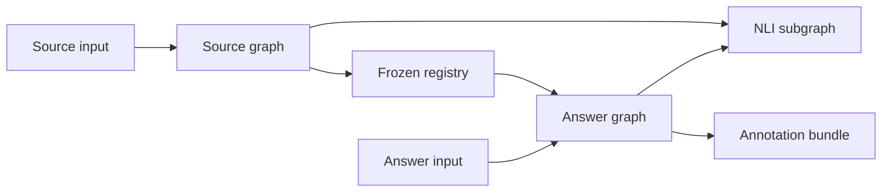

# Architecture

## Design objective

The package implements evidence-constrained local type induction as two separate state
machines. The source machine is allowed to read only context/query and produces an
immutable registry. The answer machine receives that frozen registry and may only assign
registered types or abstain. It cannot mutate the registry.

The package emits annotations and audit artifacts. HalluGraph matching and scoring remain
outside this boundary.

## Dependency direction

```text
CLI / Python API / experiment adapter
                  |
             application
        LangGraph orchestration
                  |
       domain contracts and policies
                  |
 ports: model | NLI | cache | checkpoint | artifact sink
                  |
 adapters: LiteLLM | filesystem/SQLite | in-memory fakes
```

The domain layer imports no experiment-framework, KGGen, LiteLLM or DataSphere module.
The framework adapter translates the existing shared graph bundle into standalone input
models and maps the output back to `SourceTypeRegistry`/`TypeAnnotationBundle` records.

## Public operations

### Build source registry

Input:

- `source_id`;
- raw context and query with separate provenance;
- immutable context/query graph payloads and IDs;
- configuration and dependency bundle.

Output:

- frozen hierarchical registry;
- source assignments and contextual roles;
- evidence spans and decision records;
- model/NLI usage and cache provenance;
- status `ok` or `failed`.

The operation has no answer parameter. This is an API-level leak barrier, not merely a
prompt instruction.

### Annotate answer

Input:

- source and response IDs;
- raw answer and immutable answer graph;
- previously frozen registry with a valid checksum;
- source evidence referenced by that registry.

Output:

- answer-node assignments using registry IDs or `unknown`;
- explicit answer type assertions and their NLI verdicts;
- optional edge verdicts for the later B5 integration;
- audit/provenance records;
- status `ok` or `failed`.

## Graph composition

The source and answer graphs are compiled separately and then exposed through one
facade. A reusable NLI subgraph is invoked from both graphs. This makes it impossible for
the source graph to receive answer state through a conditional branch.



## State rules

- State contains JSON-compatible values only.
- Model clients, secrets, locks and open files are injected through runtime context.
- Every state mutation is a new value; nodes do not mutate shared objects in place.
- List aggregation is explicit. Parallel chunk results include stable chunk IDs and are
  sorted before reconciliation.
- Checkpoints never contain API keys or authorization headers.
- Answer text is absent from every source-state schema and source cache key.
- Every persisted record includes `contract_version`, `prompt_manifest_sha256`, input
  hashes and provider fingerprints.

## Model boundaries

`StructuredModelPort` is the only generative model boundary. It accepts rendered
messages, a strict JSON Schema and an idempotency key. The LiteLLM adapter will reuse the
existing OpenAI-compatible gateway configuration, but the domain never imports LiteLLM.

Each invocation must:

1. render a prompt from the immutable manifest;
2. validate that all declared variables are supplied and no undeclared variable is used;
3. compute the request identity before sending;
4. check immutable cache;
5. invoke with one owner for retries and a bounded timeout;
6. require exactly one clean completion;
7. validate the response against JSON Schema;
8. write raw-envelope metadata and normalized result atomically.

429, 5xx, timeout, truncation and malformed JSON are failures. They are never converted
to a type, `neutral` or `unknown`.

## NLI policy

NLI is three-way: `entailed`, `contradicted`, `neutral`. It is not a type generator and
does not resolve entity identity.

The NLI router invokes the subgraph only for:

- non-explicit entity-to-type assignments;
- proposed parent/child or alias relations;
- suspicious cluster membership;
- explicit answer specializations or conflicts;
- ambiguous relation, direction or typed-role matches.

Each request has a short hypothesis and premise made from exact source spans. If the
premise contains only an LLM-authored definition, the evidence level is
`definition_only`; that result cannot justify alias merge or penalize an answer.

`neutral` means insufficient evidence. `contradicted` requires positive conflicting
source evidence. The NLI cache includes normalized premise/hypothesis, language, model,
prompt version, thresholds and truncation policy.

## Registry invariants

Before freeze, deterministic validation requires:

- unique stable IDs and canonical labels;
- parent edges form a directed acyclic graph;
- alias components do not contain parent/child edges;
- every confirmed assignment references an existing type;
- every decision references existing source span IDs;
- roles are distinct from permanent types;
- merge/split history is append-only;
- `definition_only` cannot confirm alias merge;
- unknown assignments have no fabricated type ID;
- the registry contains no answer graph/input hash;
- serialization round-trips canonically.

Machine-readable violations may be sent to `registry_repair` for a bounded number of
attempts. Exhaustion produces `failed`; the invalid draft is retained only as a diagnostic
artifact and is never exposed as frozen.

## Cache namespaces

Separate immutable namespaces are required:

- `source_spans`;
- `schema_overview`;
- `schema_reconcile`;
- `entity_type_decision`;
- `registry_consistency_review`;
- `cluster_split_review`;
- `nli_verdict`;
- `frozen_registry`;
- `answer_typing`;
- `edge_resolution`.

Cache identity is semantic, not filename-based: canonical input, contract and prompt
versions, model fingerprint, policy configuration and relevant graph hashes are hashed.
Changing any identity component creates a new entry; old artifacts are never overwritten.

## Concurrency

Parallel work is permitted only for independent source chunks, independent entity batches
and independent NLI hypotheses. Reconciliation and freeze are serialized. Every fan-out
item carries a stable ID, and fan-in sorts by it so output does not depend on completion
order. A global limiter bounds concurrent model requests.

## Observability

Structured events use stable fields: `run_id`, `node_id`, `attempt`, `cache_status`,
`input_sha256`, `output_sha256`, duration, token usage, model fingerprint and error class.
Raw context, answer text and secrets are excluded from ordinary logs. Full evidence text
belongs only in sealed run artifacts under the experiment data policy.

