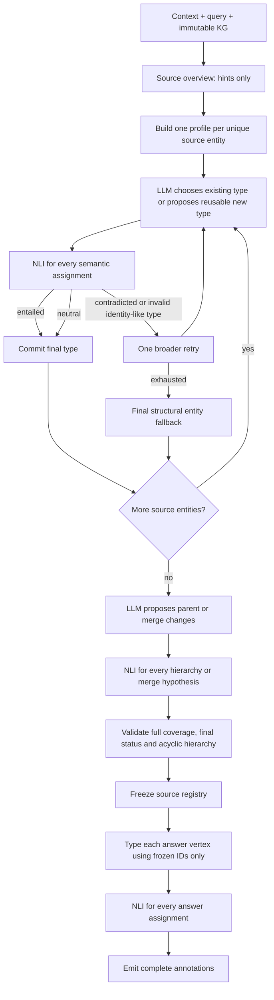

# Audit of the stopped historical typing run

## Scope

This report analyzes every `execution_trace.json`, `source_registry.json`,
`answer_annotations.json`, `input_snapshot.json` and manifest under
`runs/historical-100-typing/historical-*`, plus the shared stdout/stderr logs. The
historical artifacts were read-only. No gold labels and no review expectations were
loaded.

## Measured result

All thirteen case directories contain complete source and answer traces. Every trace has
the same six source nodes and four answer nodes, and all recorded events are
`node_completed`.

| Measure | Observed |
|---|---:|
| Source graph occurrences requiring assignments | 393 |
| Source assignments with non-empty `type_ids` | 9 |
| Unique source surfaces in input snapshots | 381 |
| Answer vertices requiring assignments | 237 |
| Answer assignments with non-empty `type_ids` | 2 |
| Registry types | 318 |
| Types marked `preliminary` | 293 |
| Types marked `confirmed` | 25 |
| Final non-root hierarchy edges | 0 |
| NLI results across all cases | 1 |

The nine source assignments demonstrate the unsafe rule directly. Examples include
`half -> 2″`, `mass marketing -> means`, and `prominent newspaper -> New York Herald`.
They were produced only because a generic `is` edge was treated as a type assertion.

## Root causes

### Entity-to-type mapping

The live graph did not execute the designed `entity_type_decision` node. The
`schema_overview` model successfully proposed 12–44 reusable types per case, but
`derive_registry` did not ask the model to type graph entities. It assigned types only
when an extracted relation label matched a tiny hard-coded set such as `is` or `is a`.
All other vertices were emitted as `unknown`.

This is an implementation error, not a display problem and not an LLM transport error.
The empty `type_ids` are present in `source_registry.json` itself.

### LLM

All thirteen `schema_overview` calls completed and returned schema-valid responses.
There is no recorded LLM failure in these traces. However, the old system prompt allowed
unsupported specificity to remain `preliminary` and did not make clear enough that a type
must be a reusable category for later HalluGraph comparison. Some draft labels therefore
mixed identity, roles and categories. This is a prompt-quality issue, but it did not cause
the near-zero assignment coverage: the code never consumed the drafts entity-by-entity.

### NLI

No source assignment was routed to NLI. Answer NLI examined only graph edges recognized
by the same narrow type-relation predicate and only when the edge object was not already
a registry label. This produced one NLI request in thirteen cases. HHEM itself did not
fail; stderr contains model/configuration and TensorFlow informational warnings only.

### Finalization status

Every type copied from `schema_overview` was hard-coded as `preliminary`. No later node
promoted or rejected it. The frozen-registry validator allowed preliminary and unknown
records, so an incomplete draft could be serialized as frozen.

### Hierarchy

The LLM proposed many non-root `parent_candidate_ids`—at least one in most cases—but
`derive_registry` discarded every proposed parent and assigned `(T-ENTITY,)` to each
model type. No consistency-review or hierarchy-NLI node ran. The root-only hierarchy is
therefore an implementation loss, not evidence that the model could not propose a
hierarchy.

### Viewer and process logs

The viewer reflected the stored empty assignments; it did not remove `type_ids`.
It showed only answer NLI and had a fixed ten-node order, so it would not have displayed
future source/hierarchy NLI clearly. The stopped run's stdout is empty; stderr contains no
case-level algorithm exception. Runtime length comes from one large overview call per
case plus local HHEM initialization, not from the intended entity-by-entity algorithm,
which was absent.

## Implemented repair

Prompt set v2 and algorithm v3 use this workflow:

The runtime now enforces:

- one entity per model typing call;
- graph neighbourhood plus relevant source spans in each entity profile;
- no automatic `X --relation--> Y` to `type(X)=Y` conversion;
- NLI for every source/answer entity decision and every structural proposal;
- `entailed` source assignments receive strong evidence; `neutral` non-conflicting
  source assignments may still finalize with weaker evidence;
- one bounded broader retry after contradicted or identity-like semantic typing;
- root fallback only after NLI-gated semantic attempts;
- one assignment with non-empty `type_ids` for every source and answer graph vertex;
- only `final` types in a frozen registry;
- preservation of an NLI-accepted parent edge or two-directionally accepted merge;
- flat type sets when hierarchy evidence is insufficient;
- cache identity including full graph payload, prompt hash and algorithm version.

The viewer now includes source, answer and hierarchy NLI records and the expanded node
trace. Full 100-case live execution remains explicitly prohibited during repair.
