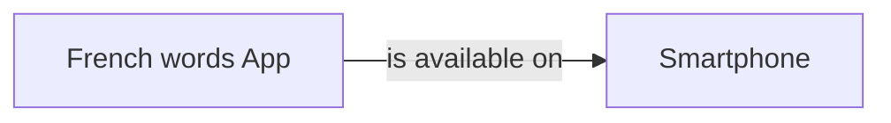
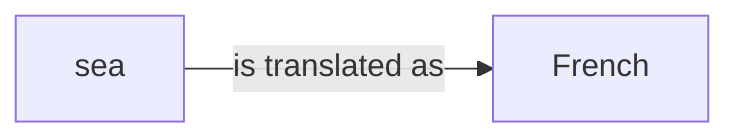
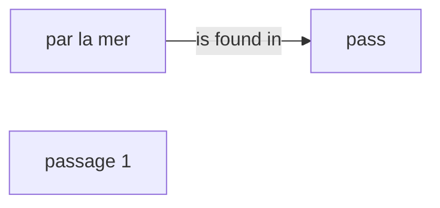
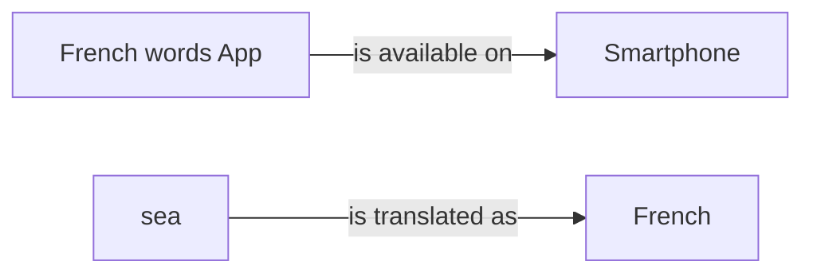

# KGGen micro demo — QA extraction

This vault contains extraction plus a one-record structural audit.

## Run metadata

- Model: `openrouter/nvidia/nemotron-nano-9b-v2:free`
- Source ID: `12202`
- Response ID: `16264`
- Split / human label: `train` / `1`
- Input lengths (characters): C=630, Q=35, A=233
- Full C/Q/A text and machine-readable graph data: `graphs.json`.
- [[entity_index|Open the entity index]] or open this directory as an Obsidian vault for Graph View.

## Input text

### Retrieved context (C)

```text
passage 1:French words App for iPhone, Android. If you were wondering how to say a word or a phrase in Spanish, French, German, Italian, Chinese, Japanese or Russian, this site will help you to get the answer.

passage 2:In this video we learn how to say 'See you later' as well as 'See you tomorrow'. How to Speak French Playlist: http://www.youtube.com/view_play_list... More French Phrases From Mahalo.com: How to Ask For The Time in French: http://www.mahalo.com/how-to-ask-for-...

passage 3:How do you say any in French? The French word for any is generally de in a negative sentence, and the same as for some in a question.
```

### User query (Q)

```text
how do you say by the sea in french
```

### Model response (A)

```text
Based on the given passages, the correct translation of "by the sea" in French is:

"par la mer"

This can be found in passage 1, which provides a list of French words and phrases, including "par la mer" as a way to say "by the sea".
```

## One-record audit

- Illustrative α: `0.70` (not tuned on one record)
- EG: `0.0000` · RP: `0.0000` · CFI: `0.0000` · H: `1.0000`
- Ungrounded entities: 2 · Unsupported relations: 1
- Full audit record: `audit/16264.json`.

## Graph statistics

Directed density excludes self-loops and is `E / (V × (V − 1))`.

| Graph | V | E | Self-loops | Avg. out-degree | Directed density |
|---|---:|---:|---:|---:|---:|
| G_C | 2 | 1 | 0 | 0.5000 | 0.500000 |
| G_Q | 2 | 1 | 0 | 0.5000 | 0.500000 |
| G_A | 3 | 1 | 0 | 0.3333 | 0.166667 |
| G_ref | 4 | 2 | 0 | 0.5000 | 0.166667 |

## G_C



| Subject | Relation | Object |
|---|---|---|
| French words App | is available on | Smartphone |

## G_Q



| Subject | Relation | Object |
|---|---|---|
| sea | is translated as | French |

## G_A



| Subject | Relation | Object |
|---|---|---|
| par la mer | is found in | pass |

## G_ref



| Subject | Relation | Object |
|---|---|---|
| French words App | is available on | Smartphone |
| sea | is translated as | French |
