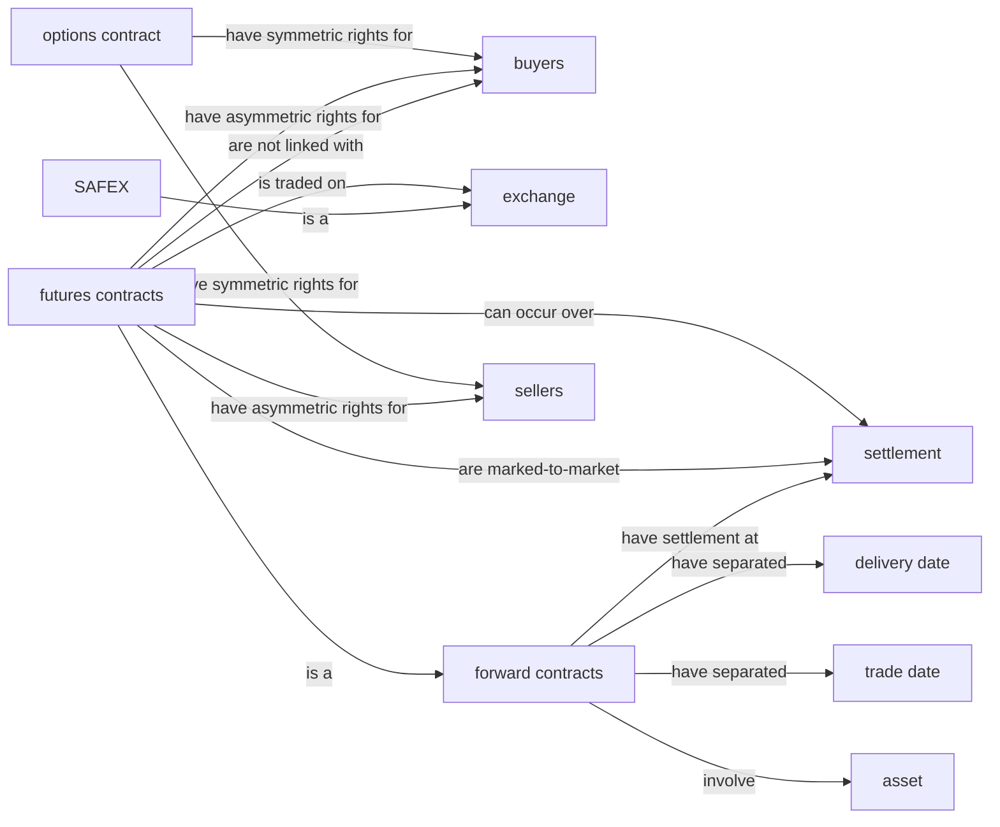
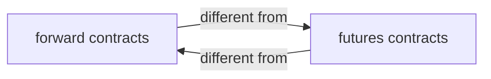
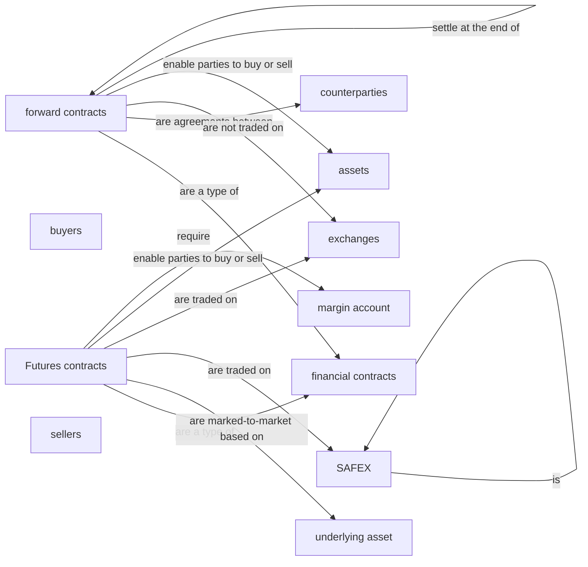
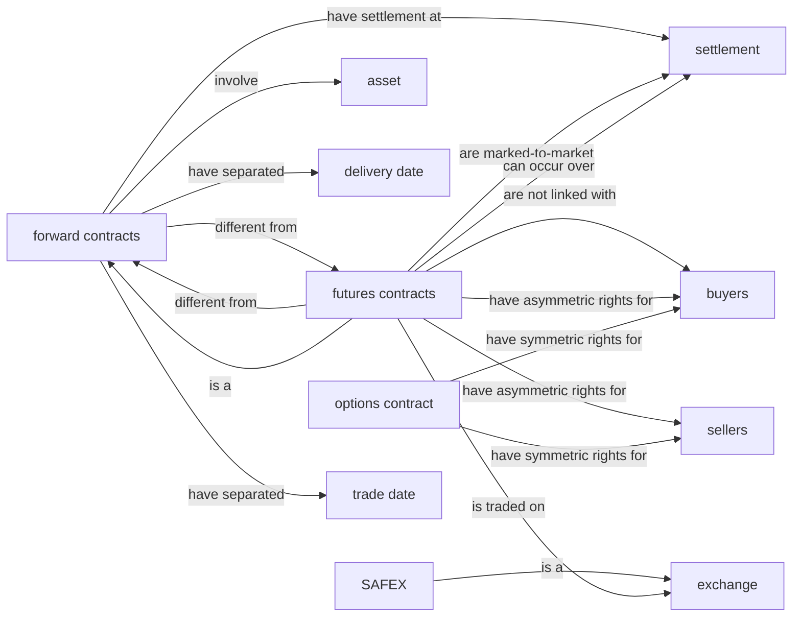

# KGGen micro demo — QA extraction

This vault contains extraction plus a one-record structural audit.

## Run metadata

- Model: `gemini/gemini-3.1-flash-lite`
- Source ID: `15457`
- Response ID: `15221`
- Split / human label: `train` / `0`
- Input lengths (characters): C=902, Q=88, A=1359
- Full C/Q/A text and machine-readable graph data: `graphs.json`.
- [[entity_index|Open the entity index]] or open this directory as an Obsidian vault for Graph View.

## Input text

### Retrieved context (C)

```text
passage 1:For forward contracts, settlement of the contract occurs at the end of the contract. Futures contracts are marked-to-market daily, which means that daily changes are settled day by day until the end of the contract. Furthermore, settlement for futures contracts can occur over a range of dates.

passage 2:A forward contract is an agreement between two parties to buy or sell an asset at an agreed future point in time. The trade date and delivery date are separated. A futures contract is a standardized forward contract that is traded on an exchange, like SAFEX. Other than forward contracts, futures contracts are not linked with specific buyers.

passage 3:B) in a futures contract, the buyer and seller have asymmetric rights, whereas in an options contract,the buyer and seller have symmetric rights. C) in both futures and options contracts, the buyer and seller have symmetric rights.
```

### User query (Q)

```text
what are futures contracts and forward contracts? describe two differences between them.
```

### Model response (A)

```text
Futures contracts and forward contracts are both financial contracts that enable parties to buy or sell assets at predetermined prices on future dates. However, there are some key differences between the two.

Firstly, futures contracts are standardized agreements that are traded on exchanges, such as the South African Futures Exchange (SAFEX). They are not tailored to the needs of specific individuals or organizations, and they are not linked to specific buyers or sellers. Forward contracts, on the other hand, are customized agreements between two counterparties that are not traded on exchanges.

Secondly, futures contracts are marked-to-market daily, which means that any changes in the value of the underlying asset are settled on a daily basis until the contract expires. This means that the parties involved in a futures contract must maintain a margin account to cover potential losses. Forward contracts, on the other hand, settle only at the end of the contract period.

Therefore, the main differences between futures contracts and forward contracts are:

1. Standardization: Futures contracts are standardized and traded on exchanges, while forward contracts are customized and not traded on exchanges.
2. Marking-to-market: Futures contracts are marked-to-market daily, while forward contracts settle only at the end of the contract period.
```

## One-record audit

- Illustrative α: `0.70` (not tuned on one record)
- EG: `0.6364` · RP: `0.0000` · CFI: `0.4455` · H: `0.5545`
- Ungrounded entities: 4 · Unsupported relations: 12
- Full audit record: `audit/15221.json`.

## Graph statistics

Directed density excludes self-loops and is `E / (V × (V − 1))`.

| Graph | V | E | Self-loops | Avg. out-degree | Directed density |
|---|---:|---:|---:|---:|---:|
| G_C | 11 | 14 | 0 | 1.2727 | 0.127273 |
| G_Q | 2 | 2 | 0 | 1.0000 | 1.000000 |
| G_A | 11 | 12 | 2 | 1.0909 | 0.090909 |
| G_ref | 11 | 16 | 0 | 1.4545 | 0.145455 |

## G_C



| Subject | Relation | Object |
|---|---|---|
| SAFEX | is a | exchange |
| forward contracts | have separated | delivery date |
| forward contracts | have separated | trade date |
| forward contracts | have settlement at | settlement |
| forward contracts | involve | asset |
| futures contracts | are marked-to-market | settlement |
| futures contracts | are not linked with | buyers |
| futures contracts | can occur over | settlement |
| futures contracts | have asymmetric rights for | buyers |
| futures contracts | have asymmetric rights for | sellers |
| futures contracts | is a | forward contracts |
| futures contracts | is traded on | exchange |
| options contract | have symmetric rights for | buyers |
| options contract | have symmetric rights for | sellers |

## G_Q



| Subject | Relation | Object |
|---|---|---|
| forward contracts | different from | futures contracts |
| futures contracts | different from | forward contracts |

## G_A



| Subject | Relation | Object |
|---|---|---|
| Futures contracts | are a type of | financial contracts |
| Futures contracts | are marked-to-market based on | underlying asset |
| Futures contracts | are traded on | SAFEX |
| Futures contracts | are traded on | exchanges |
| Futures contracts | enable parties to buy or sell | assets |
| Futures contracts | require | margin account |
| SAFEX | is | SAFEX |
| forward contracts | are a type of | financial contracts |
| forward contracts | are agreements between | counterparties |
| forward contracts | are not traded on | exchanges |
| forward contracts | enable parties to buy or sell | assets |
| forward contracts | settle at the end of | forward contracts |

## G_ref



| Subject | Relation | Object |
|---|---|---|
| SAFEX | is a | exchange |
| forward contracts | different from | futures contracts |
| forward contracts | have separated | delivery date |
| forward contracts | have separated | trade date |
| forward contracts | have settlement at | settlement |
| forward contracts | involve | asset |
| futures contracts | are marked-to-market | settlement |
| futures contracts | are not linked with | buyers |
| futures contracts | can occur over | settlement |
| futures contracts | different from | forward contracts |
| futures contracts | have asymmetric rights for | buyers |
| futures contracts | have asymmetric rights for | sellers |
| futures contracts | is a | forward contracts |
| futures contracts | is traded on | exchange |
| options contract | have symmetric rights for | buyers |
| options contract | have symmetric rights for | sellers |
