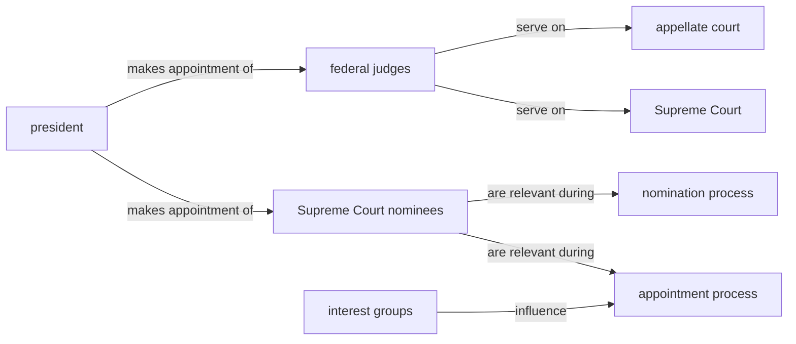
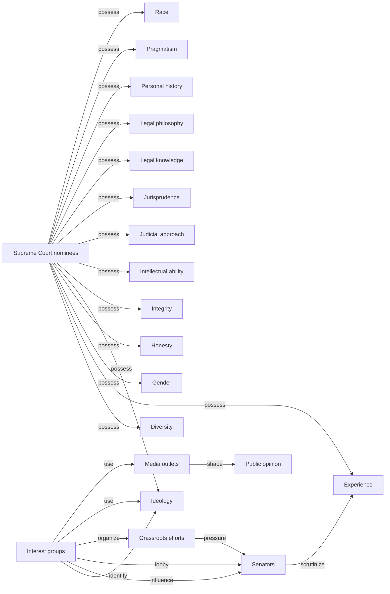
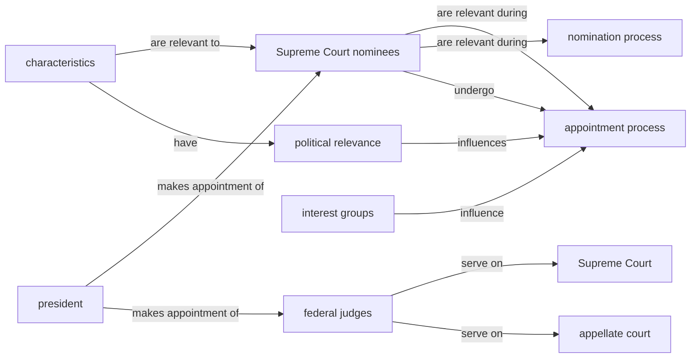

# KGGen micro demo — QA extraction

This vault contains extraction plus a one-record structural audit.

## Run metadata

- Model: `gemini/gemini-3.1-flash-lite`
- Source ID: `12189`
- Response ID: `16185`
- Split / human label: `train` / `1`
- Input lengths (characters): C=837, Q=117, A=2011
- Full C/Q/A text and machine-readable graph data: `graphs.json`.
- [[entity_index|Open the entity index]] or open this directory as an Obsidian vault for Graph View.

## Input text

### Retrieved context (C)

```text
passage 1:Identify three characteristics of Supreme Court nominees and discuss how each characteristic has been politically relevant during the appointment process. Identify two methods that have been used by interest groups to influence the appointment process.

passage 2:Identify three characteristics of Supreme Court nominees and discuss how each characteristic has been politically relevant during the appointment process. Identify two methods that have been used by interest groups to influence the appointment process.

passage 3:Under Supreme Court. One of the most important decisions a president can make is the appointment of federal judges, especially those on the appellate and Supreme Court. a) Identify and discuss two characteristics of Supreme Court nominees that are politically relevant during the nomination process.
```

### User query (Q)

```text
list how the three characteristics of supreme court nominees are politically relevant during the appointment process.
```

### Model response (A)

```text
Based on the provided passages, here are the three characteristics of Supreme Court nominees that are politically relevant during the appointment process:

Passage 1:

* Experience: Nominees' experience as a judge or lawyer has been a key factor in their confirmation. Senators often scrutinize a nominee's experience to determine their suitability for the position (Passage 1).
* Ideology: Nominees' legal philosophy and judicial approach have been highly influential in shaping their political relevance during the appointment process. Interest groups often try to identify nominees who share their ideological views and use this information to influence the Senate's decision (Passage 1).
* Diversity: The diversity of the nominee's background, including their race, gender, and personal history, has become an increasingly important factor in the appointment process (Passage 1).

Passage 2:

* Jurisprudence: Nominees' legal jurisprudence and approach to interpreting the law have been highly relevant during the appointment process (Passage 2).
* Integrity: The integrity and honesty of the nominee have been critical factors in determining their suitability for the position (Passage 2).

Passage 3:

* Intellectual ability: The intellectual abilities and legal knowledge of the nominee have been important considerations during the appointment process (Passage 3).
* Pragmatism: Nominees' willingness to apply legal principles in a pragmatic and practical manner has been viewed as an important quality during the appointment process (Passage 3).

In terms of methods used by interest groups to influence the appointment process, passage 1 mentions:

* Lobbying Senators directly to support or oppose a nominee (Passage 1)
* Organizing campaigns to promote or undermine a nominee's confirmation (Passage 1)

Passage 2 also mentions:

* Using media outlets to shape public opinion about a nominee (Passage 2)
* Organizing grassroots efforts to pressure Senators to support or oppose a nominee (Passage 2)
```

## One-record audit

- Illustrative α: `0.70` (not tuned on one record)
- EG: `0.1000` · RP: `0.0000` · CFI: `0.0700` · H: `0.9300`
- Ungrounded entities: 18 · Unsupported relations: 23
- Full audit record: `audit/16185.json`.

## Graph statistics

Directed density excludes self-loops and is `E / (V × (V − 1))`.

| Graph | V | E | Self-loops | Avg. out-degree | Directed density |
|---|---:|---:|---:|---:|---:|
| G_C | 8 | 7 | 0 | 0.8750 | 0.125000 |
| G_Q | 4 | 4 | 0 | 1.0000 | 0.333333 |
| G_A | 20 | 23 | 0 | 1.1500 | 0.060526 |
| G_ref | 10 | 11 | 0 | 1.1000 | 0.122222 |

## G_C



| Subject | Relation | Object |
|---|---|---|
| Supreme Court nominees | are relevant during | appointment process |
| Supreme Court nominees | are relevant during | nomination process |
| federal judges | serve on | Supreme Court |
| federal judges | serve on | appellate court |
| interest groups | influence | appointment process |
| president | makes appointment of | Supreme Court nominees |
| president | makes appointment of | federal judges |

## G_Q


| Subject | Relation | Object |
|---|---|---|
| Supreme Court nominees | undergo | appointment process |
| characteristics | are relevant to | Supreme Court nominees |
| characteristics | have | political relevance |
| political relevance | influences | appointment process |

## G_A



| Subject | Relation | Object |
|---|---|---|
| Grassroots efforts | pressure | Senators |
| Interest groups | identify | Ideology |
| Interest groups | influence | Senators |
| Interest groups | lobby | Senators |
| Interest groups | organize | Grassroots efforts |
| Interest groups | use | Ideology |
| Interest groups | use | Media outlets |
| Media outlets | shape | Public opinion |
| Senators | scrutinize | Experience |
| Supreme Court nominees | possess | Diversity |
| Supreme Court nominees | possess | Experience |
| Supreme Court nominees | possess | Gender |
| Supreme Court nominees | possess | Honesty |
| Supreme Court nominees | possess | Ideology |
| Supreme Court nominees | possess | Integrity |
| Supreme Court nominees | possess | Intellectual ability |
| Supreme Court nominees | possess | Judicial approach |
| Supreme Court nominees | possess | Jurisprudence |
| Supreme Court nominees | possess | Legal knowledge |
| Supreme Court nominees | possess | Legal philosophy |
| Supreme Court nominees | possess | Personal history |
| Supreme Court nominees | possess | Pragmatism |
| Supreme Court nominees | possess | Race |

## G_ref



| Subject | Relation | Object |
|---|---|---|
| Supreme Court nominees | are relevant during | appointment process |
| Supreme Court nominees | are relevant during | nomination process |
| Supreme Court nominees | undergo | appointment process |
| characteristics | are relevant to | Supreme Court nominees |
| characteristics | have | political relevance |
| federal judges | serve on | Supreme Court |
| federal judges | serve on | appellate court |
| interest groups | influence | appointment process |
| political relevance | influences | appointment process |
| president | makes appointment of | Supreme Court nominees |
| president | makes appointment of | federal judges |
