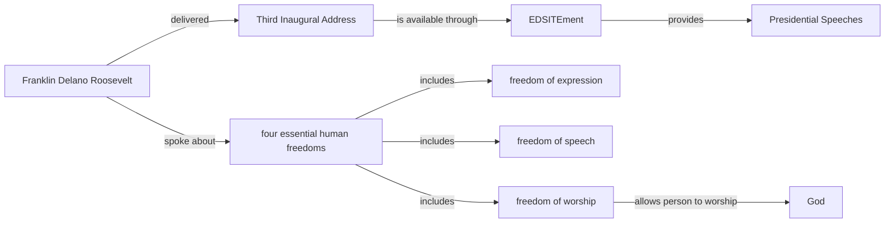
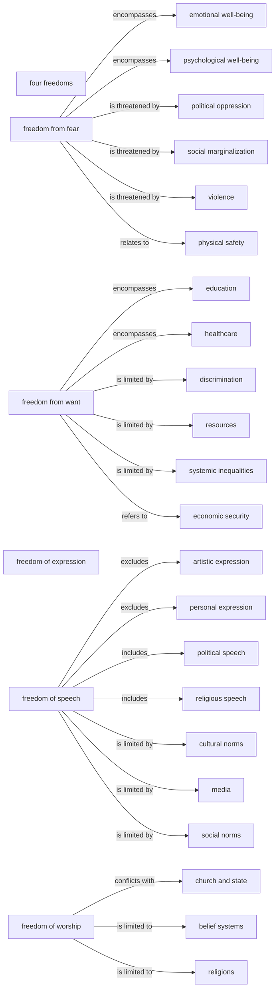
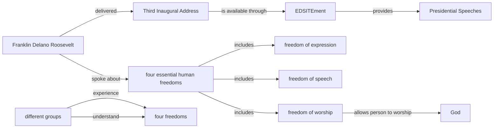

# KGGen micro demo — QA extraction

This vault contains extraction plus a one-record structural audit.

## Run metadata

- Model: `gemini/gemini-3.1-flash-lite`
- Source ID: `12238`
- Response ID: `16479`
- Split / human label: `train` / `1`
- Input lengths (characters): C=912, Q=79, A=1748
- Full C/Q/A text and machine-readable graph data: `graphs.json`.
- [[entity_index|Open the entity index]] or open this directory as an Obsidian vault for Graph View.

## Input text

### Retrieved context (C)

```text
passage 1:Sometimes we fail to hear or heed these voices of freedom because to us the privilege of our freedom is such an old, old story. —Franklin Delano Roosevelt, in his Third Inaugural Address, January 20, 1941. Full text of the speech is available through the EDSITEment resource, Presidential Speeches.

passage 2:In the future days, which we seek to make secure, we look forward to a world founded upon four essential human freedoms. The first is freedom of speech and expression -- everywhere in the world. The second is freedom of every person to worship God in his own way -- everywhere in the world.

passage 3:In the future days, which we seek to make secure, we look forward to a world founded upon four essential human freedoms. The first is freedom of speech and expression -- everywhere in the world. The second is freedom of every person to worship God in his own way -- everywhere in the world.
```

### User query (Q)

```text
how did different groups understand or experience the four freedoms differently
```

### Model response (A)

```text
Based on the provided passages, here are some ways in which different groups may have understood or experienced the four freedoms differently:

1. Freedom of speech and expression:
	* Some groups may have interpreted this freedom as only applying to certain types of speech or expression, such as political or religious speech, while excluding other forms of expression, like artistic or personal expression.
	* Others may have seen this freedom as limited by cultural or social norms, such as taboos around discussing sensitive topics or censorship in the media.
2. Freedom of worship:
	* Some groups may have viewed this freedom as limited to specific religions or belief systems, while excluding others. For example, a group may have believed that only their particular religion was deserving of this freedom.
	* Others may have seen this freedom as conflicting with their own beliefs or values, such as those who believe in the separation of church and state.
3. Freedom from want:
	* Some groups may have understood this freedom as primarily referring to economic security, while others may have seen it as encompassing broader aspects of well-being, such as access to education or healthcare.
	* Additionally, some groups may have experienced this freedom as limited by systemic inequalities, such as discrimination or unequal access to resources.
4. Freedom from fear:
	* Some groups may have viewed this freedom as related solely to physical safety, while others may have seen it as encompassing psychological or emotional well-being as well.
	* Additionally, some groups may have experienced this freedom as threatened by factors such as political oppression, violence, or social marginalization.

Unable to answer based on given passages.
```

## One-record audit

- Illustrative α: `0.70` (not tuned on one record)
- EG: `0.1429` · RP: `0.0000` · CFI: `0.1000` · H: `0.9000`
- Ungrounded entities: 24 · Unsupported relations: 22
- Full audit record: `audit/16479.json`.

## Graph statistics

Directed density excludes self-loops and is `E / (V × (V − 1))`.

| Graph | V | E | Self-loops | Avg. out-degree | Directed density |
|---|---:|---:|---:|---:|---:|
| G_C | 9 | 8 | 0 | 0.8889 | 0.111111 |
| G_Q | 2 | 2 | 0 | 1.0000 | 1.000000 |
| G_A | 28 | 22 | 0 | 0.7857 | 0.029101 |
| G_ref | 11 | 10 | 0 | 0.9091 | 0.090909 |

## G_C



| Subject | Relation | Object |
|---|---|---|
| EDSITEment | provides | Presidential Speeches |
| Franklin Delano Roosevelt | delivered | Third Inaugural Address |
| Franklin Delano Roosevelt | spoke about | four essential human freedoms |
| Third Inaugural Address | is available through | EDSITEment |
| four essential human freedoms | includes | freedom of expression |
| four essential human freedoms | includes | freedom of speech |
| four essential human freedoms | includes | freedom of worship |
| freedom of worship | allows person to worship | God |

## G_Q


| Subject | Relation | Object |
|---|---|---|
| different groups | experience | four freedoms |
| different groups | understand | four freedoms |

## G_A



| Subject | Relation | Object |
|---|---|---|
| freedom from fear | encompasses | emotional well-being |
| freedom from fear | encompasses | psychological well-being |
| freedom from fear | is threatened by | political oppression |
| freedom from fear | is threatened by | social marginalization |
| freedom from fear | is threatened by | violence |
| freedom from fear | relates to | physical safety |
| freedom from want | encompasses | education |
| freedom from want | encompasses | healthcare |
| freedom from want | is limited by | discrimination |
| freedom from want | is limited by | resources |
| freedom from want | is limited by | systemic inequalities |
| freedom from want | refers to | economic security |
| freedom of speech | excludes | artistic expression |
| freedom of speech | excludes | personal expression |
| freedom of speech | includes | political speech |
| freedom of speech | includes | religious speech |
| freedom of speech | is limited by | cultural norms |
| freedom of speech | is limited by | media |
| freedom of speech | is limited by | social norms |
| freedom of worship | conflicts with | church and state |
| freedom of worship | is limited to | belief systems |
| freedom of worship | is limited to | religions |

## G_ref



| Subject | Relation | Object |
|---|---|---|
| EDSITEment | provides | Presidential Speeches |
| Franklin Delano Roosevelt | delivered | Third Inaugural Address |
| Franklin Delano Roosevelt | spoke about | four essential human freedoms |
| Third Inaugural Address | is available through | EDSITEment |
| different groups | experience | four freedoms |
| different groups | understand | four freedoms |
| four essential human freedoms | includes | freedom of expression |
| four essential human freedoms | includes | freedom of speech |
| four essential human freedoms | includes | freedom of worship |
| freedom of worship | allows person to worship | God |
