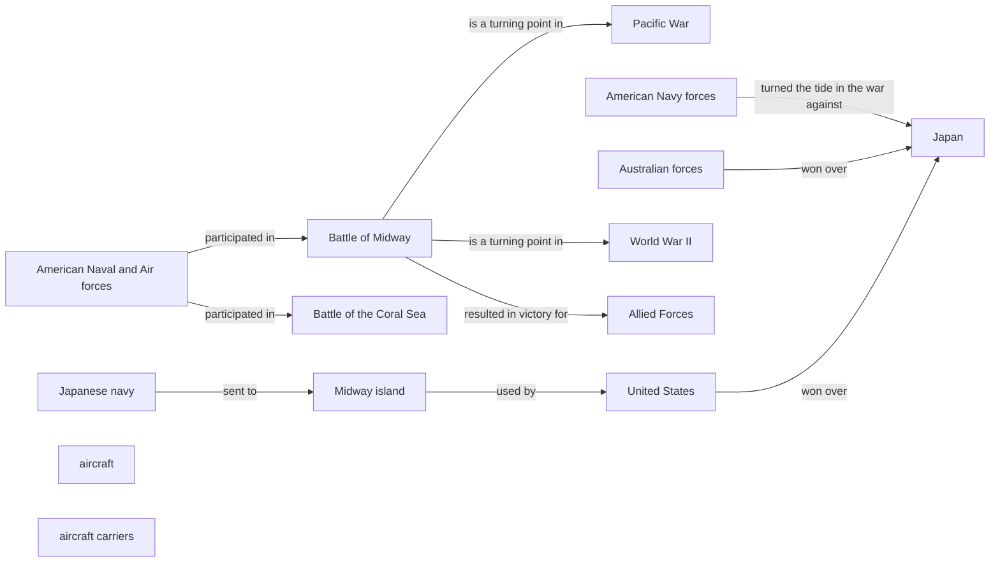
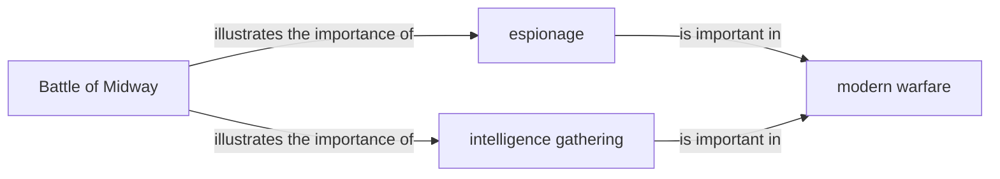
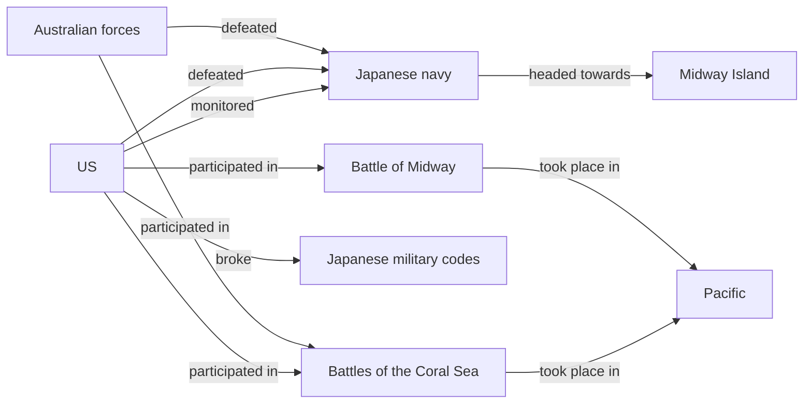
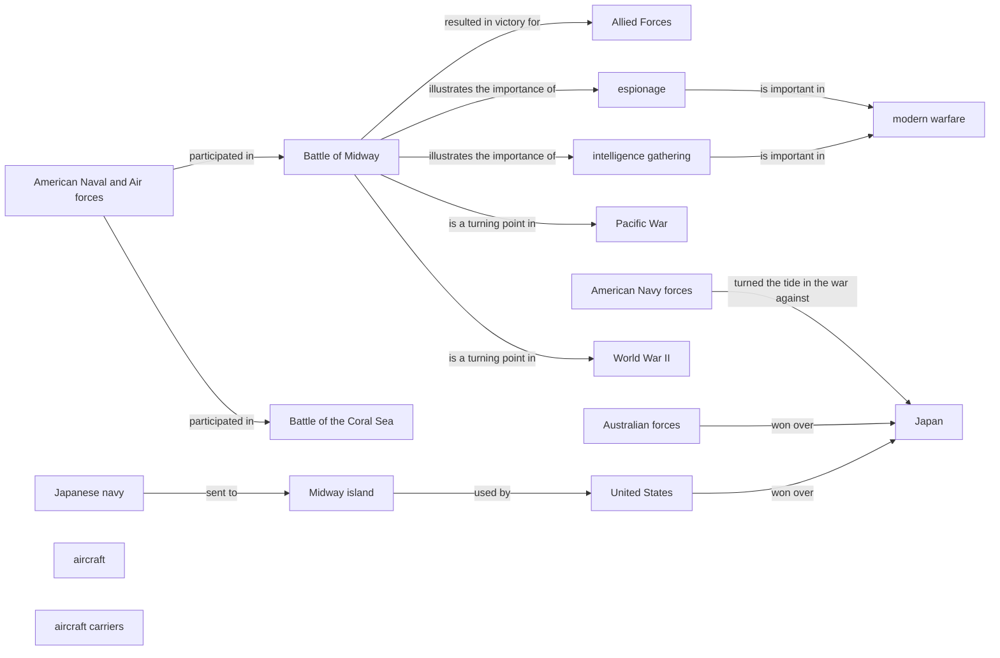

# KGGen micro demo — QA extraction

This vault contains extraction plus a one-record structural audit.

## Run metadata

- Model: `gemini/gemini-3.1-flash-lite`
- Source ID: `12263`
- Response ID: `16629`
- Split / human label: `train` / `1`
- Input lengths (characters): C=838, Q=114, A=1161
- Full C/Q/A text and machine-readable graph data: `graphs.json`.
- [[entity_index|Open the entity index]] or open this directory as an Obsidian vault for Graph View.

## Input text

### Retrieved context (C)

```text
passage 1:The Battle of Midway (June 4-7, 1942) was an important turning point in World War II. The Japanese sent a majority of their navy towards Midway island, which was being used by … the US as an airfield. It was fought by aircraft launched from aircraft carriers.

passage 2:The Battle of Midway was the turning point in the Pacific War of WW2 in favor of the Allied Forces. The Japanese had lost their first big battle against anyone. They were used … to winning all the time. This battle made them lose face.

passage 3:American Naval and Air forces participated in the Battle of the Coral Sea and the Battle of Midway. In both of the battles, the United States and Australian forces won over Ja … pan (defeated Japan). With these two victories over Japan, the American Navy forces began to turn the tide in the war against Japan.
```

### User query (Q)

```text
how does the battle of midway illustrate the importance of intelligence gathering and espionage in modern warfare?
```

### Model response (A)

```text
Based on the provided passages, the Battle of Midway illustrates the importance of intelligence gathering and espionage in modern warfare in several ways:

1. Intelligence gathering: Passage 1 mentions that the US had been monitoring Japanese naval movements and knew that the Japanese navy was heading towards Midway Island. This intelligence allowed the US to prepare for the attack and deploy its own naval forces effectively.
2. Codebreaking: Passage 2 mentions that the US had broken Japanese military codes, which provided valuable insight into Japanese plans and strategies. This allowed the US to anticipate Japanese moves and prepare accordingly.
3. Surprise attack: Passage 3 mentions that the US and Australian forces were able to defeat Japan in the Battles of the Coral Sea and Midway by launching surprise attacks against the Japanese fleet. This highlights the importance of using intelligence gathered through espionage and codebreaking to gain a tactical advantage.

Overall, the Battle of Midway demonstrates the critical role that intelligence gathering and codebreaking played in the outcome of the battle and the broader war in the Pacific.
```

## One-record audit

- Illustrative α: `0.70` (not tuned on one record)
- EG: `0.7500` · RP: `0.0000` · CFI: `0.5250` · H: `0.4750`
- Ungrounded entities: 2 · Unsupported relations: 10
- Full audit record: `audit/16629.json`.

## Graph statistics

Directed density excludes self-loops and is `E / (V × (V − 1))`.

| Graph | V | E | Self-loops | Avg. out-degree | Directed density |
|---|---:|---:|---:|---:|---:|
| G_C | 14 | 10 | 0 | 0.7143 | 0.054945 |
| G_Q | 4 | 4 | 0 | 1.0000 | 0.333333 |
| G_A | 8 | 10 | 0 | 1.2500 | 0.178571 |
| G_ref | 17 | 14 | 0 | 0.8235 | 0.051471 |

## G_C



| Subject | Relation | Object |
|---|---|---|
| American Naval and Air forces | participated in | Battle of Midway |
| American Naval and Air forces | participated in | Battle of the Coral Sea |
| American Navy forces | turned the tide in the war against | Japan |
| Australian forces | won over | Japan |
| Battle of Midway | is a turning point in | Pacific War |
| Battle of Midway | is a turning point in | World War II |
| Battle of Midway | resulted in victory for | Allied Forces |
| Japanese navy | sent to | Midway island |
| Midway island | used by | United States |
| United States | won over | Japan |

## G_Q



| Subject | Relation | Object |
|---|---|---|
| Battle of Midway | illustrates the importance of | espionage |
| Battle of Midway | illustrates the importance of | intelligence gathering |
| espionage | is important in | modern warfare |
| intelligence gathering | is important in | modern warfare |

## G_A



| Subject | Relation | Object |
|---|---|---|
| Australian forces | defeated | Japanese navy |
| Australian forces | participated in | Battles of the Coral Sea |
| Battle of Midway | took place in | Pacific |
| Battles of the Coral Sea | took place in | Pacific |
| Japanese navy | headed towards | Midway Island |
| US | broke | Japanese military codes |
| US | defeated | Japanese navy |
| US | monitored | Japanese navy |
| US | participated in | Battle of Midway |
| US | participated in | Battles of the Coral Sea |

## G_ref



| Subject | Relation | Object |
|---|---|---|
| American Naval and Air forces | participated in | Battle of Midway |
| American Naval and Air forces | participated in | Battle of the Coral Sea |
| American Navy forces | turned the tide in the war against | Japan |
| Australian forces | won over | Japan |
| Battle of Midway | illustrates the importance of | espionage |
| Battle of Midway | illustrates the importance of | intelligence gathering |
| Battle of Midway | is a turning point in | Pacific War |
| Battle of Midway | is a turning point in | World War II |
| Battle of Midway | resulted in victory for | Allied Forces |
| Japanese navy | sent to | Midway island |
| Midway island | used by | United States |
| United States | won over | Japan |
| espionage | is important in | modern warfare |
| intelligence gathering | is important in | modern warfare |
